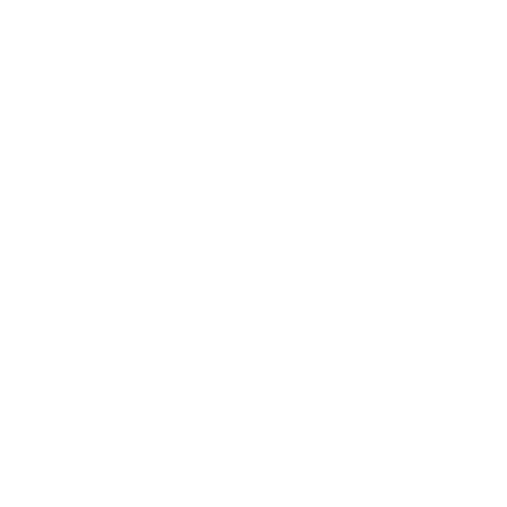
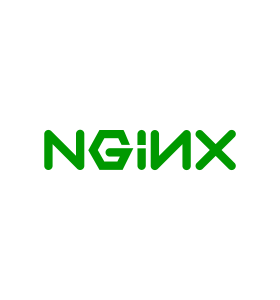

# Hi,  I am Sudip

I am currently a CS undergrad, and my fields of interest are Machine Learning and Backend Development. Additionally, I can develop appealing and responsive Web User Interfaces.

<!--
# Technologies & Tools

<table align="center">
  <tr>
    <td align="center" width="96">
        
         C++
    </td>
    <td align="center" width="96">
        
         Go
    </td>
    <td align="center" width="96">
        
         Rust
    </td>
    <td align="center" width="96">
        
         Python
    </td>
    <td align="center" width="96">
        
         JavaScript
    </td>
  </tr>
  <tr>
    <td align="center" width="96">
        
         RestAPI
    </td>
  <td align="center" width="96">
        
         ExpressJS
      </td>
    <td align="center" width="96">
        
         Django
    </td>
    <td align="center" width="96">
        
         MongoDB
    </td>
    <td align="center" width="96">
        
         PostgreSQL
    </td>
  </tr>
  <tr>
    <td align="center" width="96">
        
         Kubernetes
    </td>
    <td align="center" width="96">
        
         Docker
    </td>
    <td align="center" width="96"> 
        
         Git
    </td>
    <td align="center" width="96"> 
        
         Nginx
    </td>
    <td align="center" width="96">
        
         AWS
    </td>
  </tr>
 <tr>
    <td align="center" width="96">
        
         React
    </td>
    <td align="center" width="96">
        
         Vue
    </td>
    <td align="center" width="96">
        
         TypeScript
    </td>
    <td align="center"  width="96">
        
         HTML5
    </td>
    <td align="center" width="96">
        
         CSS
    </td>
 </tr>
</table>

-->

# Projects
### Checkout my Projects: [sudip.me/projects](https://sudip.me/projects)

# Contact
-  [Send a Mail](https://sudip.me/mail)
-  [DM me on X](https://x.com/sudiphl)

# Github Stats

